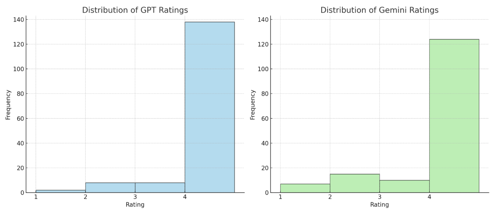
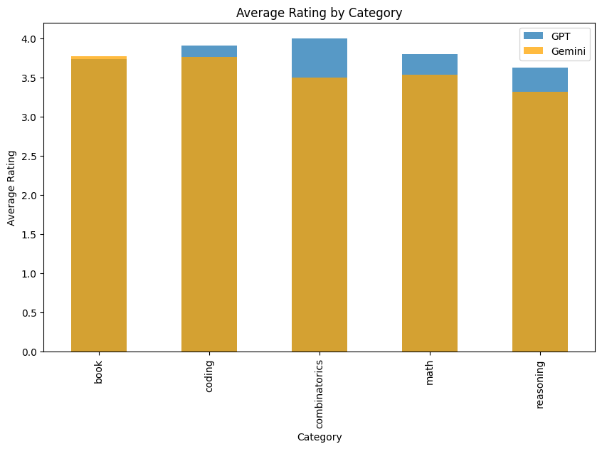

## AI Response Evaluation

This project evaluates the quality of responses generated by different AI models, specifically GPT-4o and Gemini, for a set of user questions. The evaluation is based on a predefined prompt that scores the responses on a scale of 1 to 4, considering the relevance, completeness, and helpfulness of the answers.

## Setup

1. **Install Dependencies**:
    Ensure you have all necessary packages installed. Use the following command to install dependencies:
    ```sh
    %pip install -r requirements.txt
    ```

2. **Load Environment Variables**:
    Ensure that the `.env` file contains the necessary API keys for OpenAI and Google Gemini:
    ```plaintext
    OPENAI_API_KEY=your_openai_api_key
    GOOGLE_API_KEY=your_google_api_key
    ```

## Process

1. **Load Data**:
    Load the dataset containing the questions and answers from both AI models.

2. **Clean Data**:
    Drop rows with missing questions to ensure the dataset is complete.

3. **Evaluate Responses**:
    Evaluate the responses using a predefined prompt template.

4. **Review and Rate**:
    Generate reviews and ratings for both GPT-4o and Gemini responses. Iterate through the dataset, evaluate each response, and store the reviews.

5. **Calculate Ratings**:
    Extract ratings from the reviews by parsing the review text.

6. **Save Evaluated Data**:
    Save the evaluated dataset to a CSV file for further analysis.

7. **Visualize Results**:
    Plot the average ratings by category to compare the performance of GPT-4o and Gemini.

8. **Analyze Low Ratings**:
    Identify questions with low ratings and save them for further review.

## Evaluation Scripts

- **Eval**: This script is used for the evaluation of a single model's responses.
- **Pairwise_eval**: This script compares responses from two models, providing a direct comparison of their performance.

## Question Set Directory

- The Question Set directory contains the gathered question set, with `Q4` containing the latest problems.
- The evaluated responses along with the ratings and reviews are stored in `QuestionSet/Q4_evaluated.csv`.

## Results

The evaluation produced the following key statistics:

- **Average Ratings**:
    - **GPT-4o**: Mean rating of 3.81 with a standard deviation of 0.58. The ratings indicate reliable consistency with few low ratings.
    - **Gemini**: Mean rating of 3.61 with a standard deviation of 0.84. The ratings show more variability with noticeable frequencies across all rating levels.

- **Observations**:
    - GPT-4o has a slightly higher mean rating compared to Gemini, suggesting generally better performance.
    - The standard deviation for Gemini’s ratings is higher, indicating more variability in the quality of responses.

### Visualizations

#### Distribution of Ratings





## Future Work

- **Expanded Dataset**: Increase the size and diversity of the question set to include more varied topics and difficulty levels.
- **Addition of other models**: Add more models for a more complete automated benchmark.